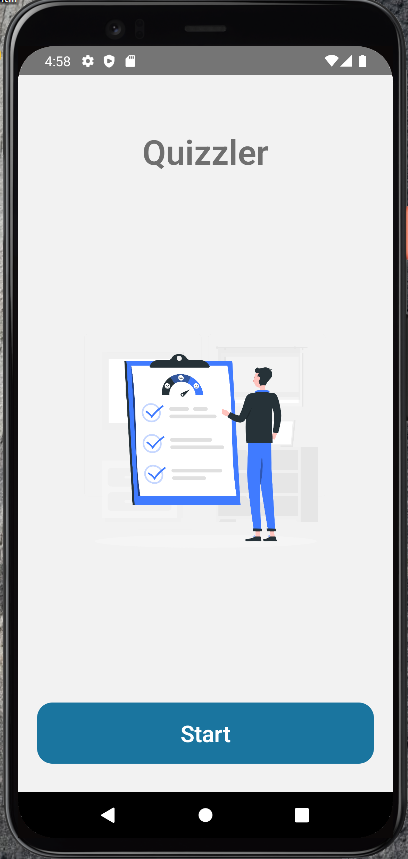
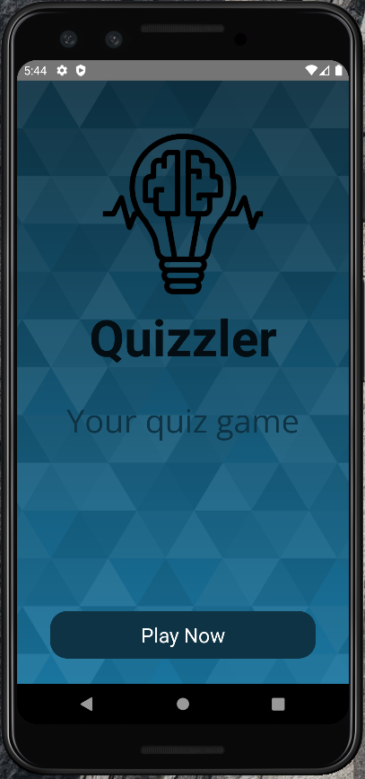
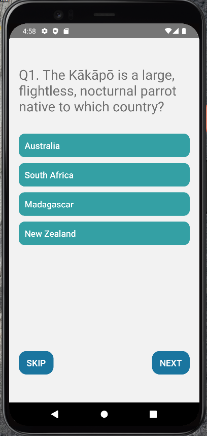
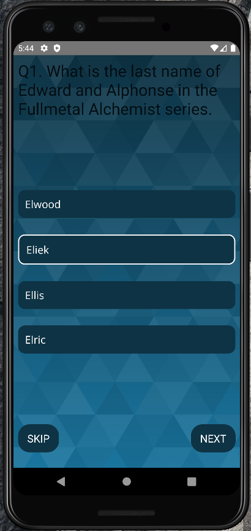
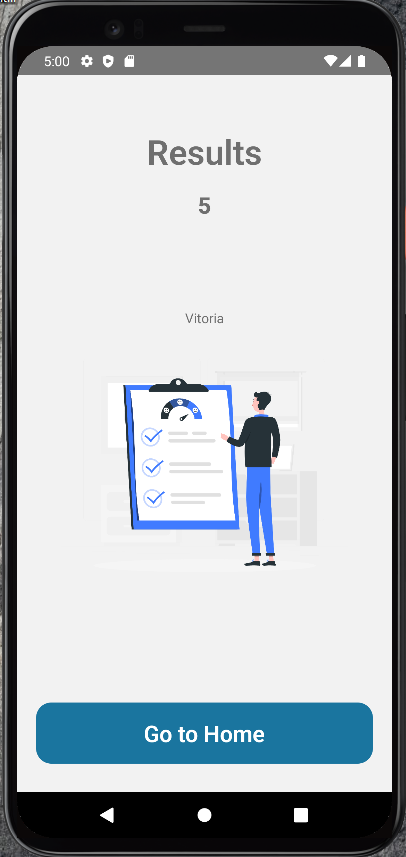
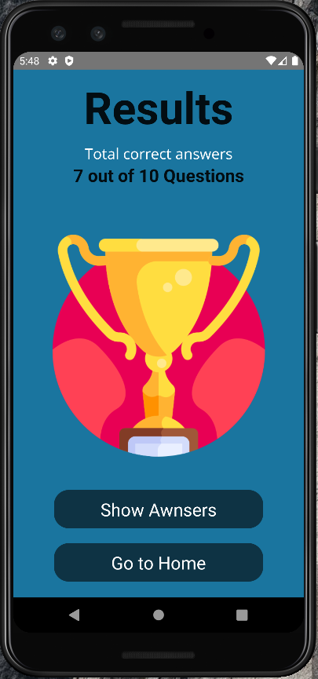
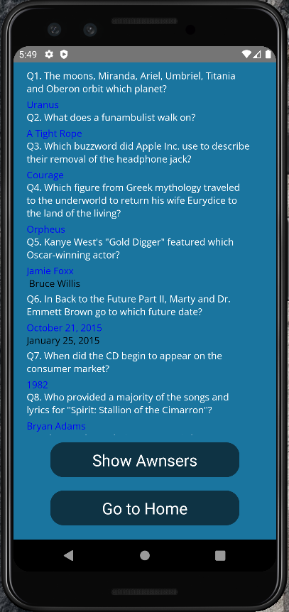

# QUIZ APP

# Sobre o projeto

Aplicação mobile de um jogo de perguntas e respostas. 

### Explicação do sistema

- Na tela inicial é mostrado o nome do jogo e um botão para dar inicio

- Quando o botão é pressionado o jogo carrega dez questões 

- Depois de responder as dez questões o jogo mostra sua pontuação

- Por fim é mostrado as respostas corretas e o jogo pode ser reiniciado

### Atualizações que desenvolvi

- Botão para pular pergunta
- Confirmação de resposta selecionada para não acontecer de pressionar sem intenção
- Respostas das perguntas

### Tela principal 


### Tela principal 2.0


### Tela quiz


### Tela quiz 2.0


### Tela resultados


### Tela resultados 2.0


### Tela respostas


# 🚀 Começando

Essas instruções permitirão que você obtenha uma cópia do projeto em operação na sua máquina local para fins de desenvolvimento e teste.

## 📋 Pré-requisitos

- npm / yarn
- virtual device

## 🔧 Instalação
### :warning::warning: **A pasta imgs**: é para guardar as imagens usadas no readme.md! Apagar ela depois do clone :warning::warning:

``` bash
## clonar repositório
git clone https://github.com/PauloCSantos/quizApp.git

## entrar na pasta do blog no terminal
cd quizapp

## instalar as dependencias
npm install

## executar o projeto
npm run android

## executar no emulador
pressiona a para abrir no android
```

## 🛠️ Construído com

- React Native
- Open TDB

## ✒️ Autor

* **Paulo C Santos** - [Linkedin](https://www.linkedin.com/in/paulocsantos1995/)

## 🖐️ Agradecimento

Agradeço ao canal Overreacted pelo tutorial 

- Link do canal: https://www.youtube.com/c/OverreactedDev
